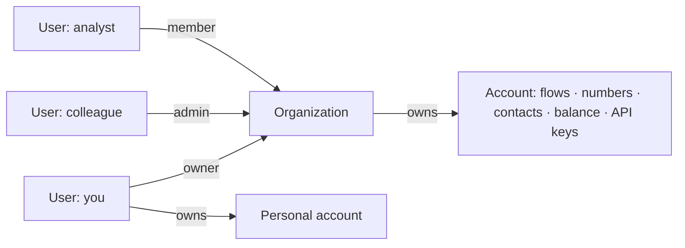

You sign up as a person and get a personal account. The moment a colleague needs to see the same flows and calls, that model runs out — sharing a login isn't access control. An **organization** is the answer: a team entity that owns an account and has members, each with a role. The account's flows, numbers, contacts, balance and API keys don't change; what changes is *who* can reach them and *what* each person may do.

## Users, accounts, organizations

- A **user** signs in once and switches between every account they can access — personal and organizational — from the account switcher (**My Accounts**).
- An **account** is the operational unit. Everything in Talkif is scoped to one: a call belongs to an account, a flow belongs to an account, a balance belongs to an account. API keys are per account.
- An **organization** owns an organizational account and holds the member list. It's the unit for *people*, not for *resources*.

So "add my colleague to Talkif" means: create an organization (if you haven't), then invite them as a member with the right role. Nothing moves; they can now open the account.

## What changes when you create one

| Aspect | Personal account | Organization account |
|---|---|---|
| Who can access | you | every active member |
| Permissions | all yours | by role — see [Members and roles](/account/members-and-roles) |
| Billing | your card | managed by the Owner; visible to Owner only |
| Deletion | you | the Owner, with the same grace period |
| Flows, numbers, contacts, balance, keys | — | identical: nothing is different about the resources themselves |

Your personal account stays as it is. Many people keep it as a sandbox and run production in the organization.

## Creating an organization

<Steps>
  <Step title="Settings → General → Create organization">
    Name it. You become its **Owner** immediately; the organization and its account are active at once.
  </Step>
  <Step title="Invite members">
    Under the organization's members, invite by email with a role. They accept from the invitation email (or it appears on their next sign-in if they already have a Talkif user).
  </Step>
  <Step title="Build in the organization's account">
    Switch to it from the account switcher. Anything you create there is the team's. If you built flows in your personal account first, recreate them here — resources don't move between accounts.
  </Step>
</Steps>

## Deleting an organization

Only the Owner can, and it deletes the organization's account with it — flows, numbers (released), contacts, history. The same two-step confirmation and grace period as account deletion apply; see [Data export and deletion](/account/data-export-and-deletion). Export first.

## Next

<CardGroup cols={2}>
  <Card title="Members and roles" href="/account/members-and-roles" icon="fa-regular fa-users">
    What Owner, Admin and Member can each do.
  </Card>
  <Card title="Authentication" href="/integrate/authentication" icon="fa-regular fa-key">
    API keys are per account — one for the organization's account.
  </Card>
</CardGroup>
