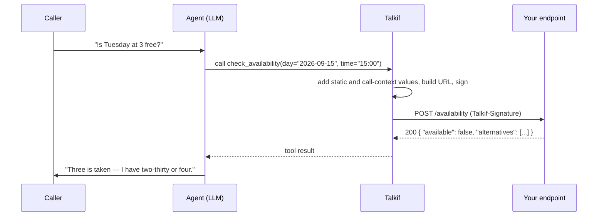

An agent that can only talk is a brochure. The moment it needs to know whether Tuesday at 3 is free, what the caller's order status is, or to actually create the ticket it just promised, it has to reach your systems. **Flow functions** are how: you describe an HTTP request once, attach it to an agent, and the model calls it when the conversation needs it. Talkif fills in the arguments, makes the request, and hands the response back to the model before its next sentence.

## How a function call happens

Three properties of this loop shape everything below:

1. **The model chooses when to call.** It reads the function's *description* the way it reads your prompt. A vague description means the model calls at the wrong moments or never.
2. **The model supplies only the arguments you let it see.** Anything you bind to a fixed value or to call context (the caller's contact ID, say) is filled in by Talkif and never shown to the model — it can't invent a customer ID.
3. **The caller is waiting.** Every millisecond your endpoint takes is silence on the line. Aim for well under a second; the hard timeout is 30 s.

## Defining a function

Functions live at account level — **Flow Builder → Flow Functions** in the builder, or [`POST /flow-functions`](/api-reference/flow-functions/create-flow-function) — and can be attached to agents in any flow. A function is a name, a description for the model, a structured request, and optional bindings.

<EndpointRequestSnippet endpoint="POST /api/v1/flow-functions" />

<AccordionGroup>
  <Accordion title="Name and description" defaultOpen>
    The **name** is the tool name the model sees (`check_availability`, `create_ticket`). The **description** is when to use it, written for the model: *"Check whether a specific date and time is available for a hygiene appointment. Call this before offering any slot to the caller."* One to three sentences; include the precondition.
  </Accordion>
  <Accordion title="Request: method, URL, and three parameter locations">
    `method` is `GET`, `POST`, `PUT`, `PATCH` or `DELETE`. `url` is fully qualified and may contain `{placeholders}`.

    Parameters are declared in three independent JSON Schema objects — `pathParams`, `queryParams`, `body` — and a name may appear in only one of them:

    | Location | Types allowed | Notes |
    |---|---|---|
    | `pathParams` | string, number, integer, boolean (optional `enum`) | Every `{placeholder}` in the URL needs a matching property, and vice versa. Values are percent-encoded — a caller can't inject path segments |
    | `queryParams` | same primitives | Appended as `?key=value` |
    | `body` | primitives plus `array` (with `items`) and `object` (with `properties`), nested to depth 5 | Sent as JSON. `GET` and `HEAD` send no body |

    `format`, `minimum`/`maximum`, `pattern`, `minLength`/`maxLength` are enforced on the model's arguments before the request is sent, so your endpoint receives valid shapes.
  </Accordion>
  <Accordion title="Bindings: where each argument comes from">
    By default every parameter is **extracted by the model from the conversation**. `paramBindings` overrides that per parameter:

    | Source | Shape | Effect |
    |---|---|---|
    | `llm` (default) | `{ "source": "llm" }` | In the model's tool schema; the model fills it |
    | `static` | `{ "source": "static", "value": "phone" }` | Fixed on every call. Hidden from the model |
    | `call_context` | `{ "source": "call_context", "contextKey": "caller.contact_id", "onNull": "reject" }` | Filled from the live call. Hidden from the model |

    Context keys you can bind: `caller.phone_number`, `caller.contact_id`, `caller.contact_name`, `caller.contact_first_name`, `caller.contact_last_name`, `caller.contact_email`, `call.id`, `call.direction`, `call.started_at`, `flow.id`, `flow.name`, `account.id`.

    `onNull` decides what happens when a context value is empty for this call (an inbound caller with no matching contact, say): **`reject`** removes the function from the model's tools for that call — it can't be called without the value; **`fallback_to_llm`** exposes the parameter to the model instead, so it can ask.
  </Accordion>
  <Accordion title="Headers and timeout">
    `webhookHeaders` is a map sent with every request — put your `Authorization` here. It's encrypted at rest and **write-only**: the API only ever reports `hasWebhookHeaders: true`. Send `null` to clear.

    `timeoutMs` is 100–30000, default 5000. Set it to what your endpoint actually needs; a long timeout is a long silence for the caller.
  </Accordion>
</AccordionGroup>

## Attaching it to an agent

In the builder, add an **HTTP Request** node, pick the function, and connect it to the agent that should be able to call it. A function is visible to the model only while the conversation is on an agent it's attached to; attach the same function to several agents if several steps need it.

Optionally set a **transition** on the function: after it's called, the conversation moves to that agent. This makes functions deterministic hand-off points — "once the booking is created, go to the confirmation agent" — and it happens **whether or not the request succeeded**. On failure the model receives the error as the tool result and carries it into the new agent, which can apologise and offer a callback.

<Info title="What is fixed at publish">
  Publishing copies the function's current definition into the flow version: name, description, schema, bindings. Editing the function afterwards doesn't change published flows until you publish again — the same rule as prompts. Headers and timeout, by contrast, are read live at call time, so rotating an API key in the function takes effect immediately.
</Info>

## What your endpoint receives

- Method, URL and body exactly as declared, with the model's arguments merged with static and context values and split back into path / query / body.
- Your `webhookHeaders`, plus a **`Talkif-Signature`** header once you've created a signing secret — verify it before acting on anything. The signing scheme (`t=…,v1=…`, HMAC-SHA256 over `"{t}.{rawBody}"`, secret rotation) is in [Webhooks](/integrate/webhooks).
- Requests come from Talkif's egress; the endpoint must be reachable on the public internet over `http` or `https`.

Constraints on the request Talkif will make — these exist to protect your systems and ours:

| Limit | Value |
|---|---|
| Timeout | your `timeoutMs`, clamped to 100 ms – 35 s |
| Request body | ≤ 1 MB |
| Response body read | ≤ 1 MB |
| Redirects | **not followed** — respond directly |
| Destinations | public IPs only; private, loopback, link-local and cloud-metadata ranges are refused, on every address the hostname resolves to |

A response is a success if the status is 200–399. The body is passed to the model as JSON; a non-JSON body arrives as `{ "raw": "<text>" }`. Keep responses small and shaped for reading aloud — the model will summarise what you return, so `{"available": false, "alternatives": ["14:30", "16:00"]}` beats a 40-field object.

## Failure handling

| What goes wrong | What the model sees | What to do in the prompt |
|---|---|---|
| Timeout or network error | an error tool result | "If a lookup fails, apologise and offer to call back" |
| 4xx / 5xx from you | the status and body | Return a helpful error body: `{"error": "slot_taken", "alternatives": […]}` |
| Argument fails schema validation | the request isn't sent; the model gets the validation error | Tighten the description ("date as YYYY-MM-DD") so the model formats correctly the first time |
| `onNull: reject` | nothing — the tool isn't offered | Give the agent an alternative path when the function is absent |

Every invocation is recorded on the call: function name, duration, status. It's visible in the call's detail view and counts toward the call's function metrics.

## Next

<CardGroup cols={2}>
  <Card title="Webhooks" href="/integrate/webhooks" icon="fa-regular fa-shield-check">
    Verify the `Talkif-Signature` header on every request.
  </Card>
  <Card title="Design a conversation" href="/build/design-a-conversation" icon="fa-regular fa-diagram-project">
    Where functions sit in a multi-agent flow.
  </Card>
</CardGroup>
