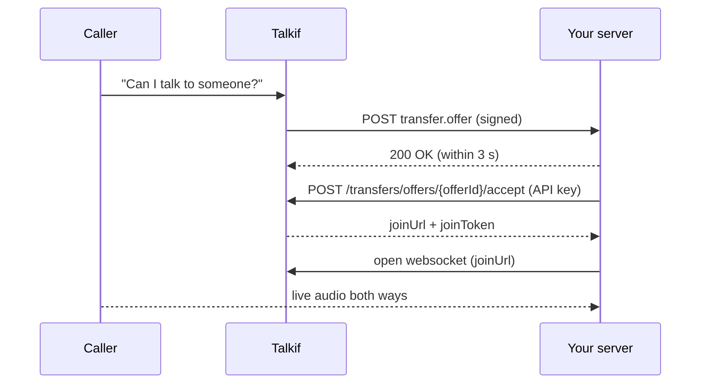

A **Your app** destination hands a live call to software you run: your own contact-center client, a CRM softphone, or another voice system. When the AI transfers, Talkif sends your server a signed webhook describing the call. Your server accepts it with an API key and joins the call audio over a websocket. The caller never hangs up and dials again.



## Set it up

<Steps>
  <Step title="Add the destination">
    **Settings → People & numbers → Add destination → Your app.** Enter a name and your webhook URL (HTTPS, reachable from the internet). Copy the **signing secret** shown after you save — it is shown once.
  </Step>
  <Step title="Create an API key for accepting">
    Create an API key with the scope **`transfer_offers:*`** (or `transfer_offers:read` + `transfer_offers:write`). It can view, accept and decline transfer offers — nothing else. A key created without scopes gets full access, so always set them. Keep your configuration keys (`transfers` scope) off the server that receives webhooks.
  </Step>
  <Step title="Point a Transfer node at it">
    On the Transfer node, under **Who should get the call?**, choose **Your app** and pick the destination. You can also put it in a destination group to ring your app, phones and people together.
  </Step>
  <Step title="Send a test">
    Open the destination and click **Send test**. Your URL receives a sample offer with `"test": true`; the result and the last 20 deliveries are shown under **Recent deliveries**.
  </Step>
</Steps>

## The offer webhook

For each transfer Talkif sends a `POST` to your URL:

| Header | Value |
|---|---|
| `Content-Type` | `application/json` |
| `Talkif-Event` | `transfer.offer` |
| `Talkif-Delivery-Id` | Unique id of this delivery (also `deliveryId` in the body) |
| `Talkif-Signature` | `t=<unix seconds>,v1=<hex HMAC-SHA256>` — see [Verify the signature](#verify-the-signature) |

```json
{
  "type": "transfer.offer",
  "offerId": "7d05b92a-1f7e-4a54-9d2e-3f0a1c5e8b10",
  "callId": "03e49616-49ae-41e8-8009-f34a3994bf9c",
  "deliveryId": "f1c2d3e4-5a6b-4c7d-8e9f-0a1b2c3d4e5f",
  "expiresAt": "2026-09-29T12:16:49Z",
  "acceptUntil": "2026-09-29T12:16:36Z",
  "mode": "cold",
  "caller": { "number": "+905321234567", "name": "Ayşe Yılmaz" },
  "case": {
    "reason": "Wants to change the delivery address",
    "summary": "Order placed yesterday; caller moved.",
    "fields": { "order_no": "A-10442" }
  },
  "flowName": "Support line",
  "test": false
}
```

- **Reply `2xx` within 3 seconds.** That means "ringing". Any other status, a timeout or a connection error counts as a decline for this call. Reply first, then accept — don't hold the webhook open while you decide.
- **Accept before `acceptUntil`.** After that the offer can no longer be taken.
- `caller.number` is the caller's number in E.164, or `null` when there is none (a browser test call, for example). `case` is `null` when the AI sent no handoff details.
- Webhooks are not retried: a call rings for seconds, so a retry would arrive after the caller is gone.

## Verify the signature

`v1` is the HMAC-SHA256 of `"<t>.<raw request body>"` with your signing secret, in hex. During a [secret rotation](#rotate-the-secret) the header carries two `v1` values — accept the request if either matches. Reject requests whose `t` is more than 5 minutes old, and use `Talkif-Delivery-Id` to drop duplicates.

<CodeBlocks>
```javascript title="Node.js"
import { createHmac, timingSafeEqual } from "node:crypto";

export function verifyTalkif(rawBody, header, secret, toleranceSecs = 300) {
  const parts = header.split(",");
  const t = parts.find((p) => p.startsWith("t="))?.slice(2);
  const sigs = parts.filter((p) => p.startsWith("v1=")).map((p) => p.slice(3));
  if (!t || Math.abs(Date.now() / 1000 - Number(t)) > toleranceSecs) return false;
  const want = createHmac("sha256", secret).update(`${t}.${rawBody}`).digest("hex");
  return sigs.some(
    (s) => s.length === want.length && timingSafeEqual(Buffer.from(s), Buffer.from(want)),
  );
}
```

```python title="Python"
import hashlib, hmac, time

def verify_talkif(raw_body: bytes, header: str, secret: str, tolerance_secs: int = 300) -> bool:
    parts = header.split(",")
    t = next((p[2:] for p in parts if p.startswith("t=")), None)
    sigs = [p[3:] for p in parts if p.startswith("v1=")]
    if t is None or abs(time.time() - int(t)) > tolerance_secs:
        return False
    want = hmac.new(secret.encode(), f"{t}.".encode() + raw_body, hashlib.sha256).hexdigest()
    return any(hmac.compare_digest(s, want) for s in sigs)
```
</CodeBlocks>

Always verify against the raw bytes you received, before parsing the JSON.

## Accept or decline

Use an API key with the `transfer_offers:*` scope:

```bash
curl -X POST https://api.talkif.ai/api/v1/transfers/offers/$OFFER_ID/accept \
  -H "Authorization: Bearer $TALKIF_API_KEY"
```

```json
{
  "joinUrl": "wss://…/join",
  "joinToken": "eyJ…",
  "callId": "03e49616-49ae-41e8-8009-f34a3994bf9c",
  "expiresAt": "2026-09-29T12:16:40Z"
}
```

- The first to accept gets the call. A later accept gets `409 offer_taken`; an accept after `acceptUntil` gets `409 offer_expired`.
- Retrying an accept with the **same key** returns a fresh join for the same claim.
- `POST …/decline` (204) lets the transfer move on without waiting for the ring timeout.
- `GET /api/v1/transfers/offers/{offerId}` returns the offer as it was delivered.

<Note>
  Join within 10 seconds of accepting. An accept that never joins counts as unanswered, and the agent carries on with the caller.
</Note>

## Join the call audio

Open a websocket to `joinUrl` with the token as the `token` query parameter (add it if `joinUrl` doesn't already carry it). Connect from your server — browser pages can't open this socket.

| | |
|---|---|
| Audio | 16 kHz, 16-bit signed little-endian PCM, mono |
| Frames | Binary messages of 640 bytes (20 ms), both directions |
| You send | Your audio as binary frames; send silence frames when you have nothing to say |
| Control | Text messages `{"type":"mute","muted":true}` and `{"type":"hangup"}` |

The call ends when either side hangs up: you close the socket (or send `hangup`), or the caller leaves and Talkif closes it.

## When an offer is withdrawn

If an offer ends before your app accepted or declined it, Talkif sends a best-effort `transfer.offer.withdrawn` webhook, signed the same way:

```json
{
  "type": "transfer.offer.withdrawn",
  "offerId": "7d05b92a-1f7e-4a54-9d2e-3f0a1c5e8b10",
  "callId": "03e49616-49ae-41e8-8009-f34a3994bf9c",
  "reason": "answered_elsewhere",
  "deliveryId": "0b9c8d7e-6f5a-4b3c-2d1e-0f9a8b7c6d5e"
}
```

`reason` is `answered_elsewhere` (someone else in the group took it), `cancelled` (the caller hung up or the transfer was stopped) or `expired`. Use it to stop ringing in your own UI.

## Rotate the secret

**Rotate secret** on the destination (or `POST /api/v1/transfers/destinations/{id}/rotate-secret`) returns a new secret once. The old one keeps working for 24 hours (`previousSecretExpiresAt`): deliveries are signed with both, so you can deploy the new secret without dropping calls.

## Limits

| | |
|---|---|
| Webhook reply | 3 seconds |
| Send test | 5 per destination per minute, 30 per account per hour |
| Your app destinations | 10 per account |
| Delivery log | Last 20 per destination, kept 30 days |

Delivery errors are reported as `No response within 3 s`, `Could not connect`, `Blocked address`, `TLS error`, `HTTP <code>` or `Delivery is unavailable`. Webhook URLs must be HTTPS on a public host; private, internal and loopback addresses are refused.

## Next

<CardGroup cols={2}>
  <Card title="Transfer calls to people" href="/build/transfer-calls-to-people" icon="fa-regular fa-phone-arrow-right">
    Transfers, warm and cold, the handoff case and destinations.
  </Card>
  <Card title="Authentication" href="/integrate/authentication" icon="fa-regular fa-key">
    Create a key with the `transfer_offers` scope.
  </Card>
</CardGroup>
