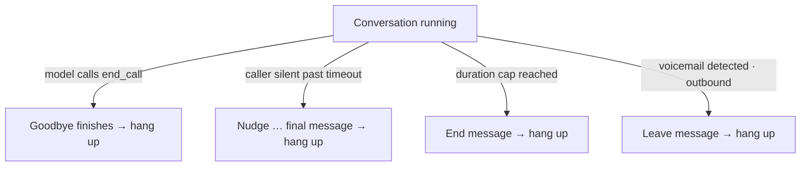

How a call ends is the part callers remember. An agent that hangs up mid-sentence, or one that says goodbye four times, undoes a good conversation. Talkif gives you one explicit way to end (the **End Call** function) and three safety nets that end a call the agent didn't — silence handling, a maximum length, and voicemail detection — each configurable per flow.

## Ending on purpose: the End Call function

`end_call` is a built-in function you attach to an agent. The model calls it when it judges the conversation is over; Talkif then lets the agent's last sentence finish playing and hangs up.

Two details keep this from going wrong:

- **The goodbye must come before the call.** `end_call` itself is silent. If the model calls it without having said goodbye, Talkif speaks a short built-in farewell first, so the caller is never cut off cold — but your own closing line is better. Tell the prompt: *"say a natural goodbye, then end the call."*
- **It always ends the call.** Whatever agent is active, whatever else the model does in the same turn, `end_call` is terminal. There's no infinite-farewell loop where the model keeps saying goodbye and re-calling it.

In the builder, add an **End Call** node and connect it to every agent that can be the last one. Its **When to end** field is the description the model reads — *"the caller has confirmed the booking and has no further questions"* — and it matters as much as the prompt.

<Steps>
  <Step title="Attach End Call to terminal agents">
    Any agent where the conversation can legitimately finish. For a triage → specialists flow, that's each specialist, not the triage agent.
  </Step>
  <Step title="Write the end condition">
    In the node's **When to end** field, state the condition. Vague ("when done") produces early hang-ups; specific ("after reading back the details and getting a yes") produces clean ones.
  </Step>
  <Step title="Tell the prompt to say goodbye first">
    One line in the Agent Prompt: *"When there is nothing else, thank them, say goodbye, and then end the call."*
  </Step>
</Steps>

## Scripted lines: Say

A **Say** node speaks fixed text verbatim, without the model — a legal disclaimer, a hold message, a line that must be identical on every call. It attaches to an agent as a **pre-action** (spoken when the conversation enters that agent) or a **post-action** (spoken when it leaves). The text supports the same `{{variables}}` as prompts.

Use Say for lines that must not vary. Use the prompt for everything else — a scripted greeting sounds scripted.

## Safety net 1: silence handling

When the caller goes quiet after the agent finishes speaking, the agent checks in — *"Are you still there?"* — and if silence continues, says a fixed goodbye and hangs up. **On by default** for every flow.

Each silence escalates: the first checks are short nudges the model composes to fit the conversation's language and tone; the last one is a fixed message, then hang-up.

| Setting | Default | Range | What it does |
|---|---|---|---|
| **Enabled** | on | — | The only way to opt out is to turn it off |
| **Timeout** | 10 s | 1–600 s | Caller silence, after the agent stops, before the first nudge. Keep it above your model's reply time |
| **Max prompts** | 2 | 1–10 | Total checks. Checks 1…N−1 nudge; check N speaks the end message and hangs up. Default = one "still there?", then end |
| **Reset on caller speech** | off | — | Off: the counter only counts up, so an abandoned call always ends even with background noise. On: any caller speech restarts the count — kinder to long pauses, but noise can keep a dead call alive |
| **Prompts** | built-in | ≤ 10 | Your own instructions for composing each nudge; the last one is reused if there are fewer than needed |
| **End message** | built-in | ≤ 1000 chars | Spoken verbatim on the final check |

<Tip>
  Leave **Reset on caller speech** off unless your calls have genuinely long expected pauses (a caller looking up a reference number). The monotonic counter is what guarantees an unattended call ends.
</Tip>

## Safety net 2: maximum call length

A hard ceiling on a call's duration, measured from answer. When reached, the agent speaks a goodbye and hangs up regardless of where the conversation is. **Off by default** — the right limit is yours to choose.

| Setting | Default | Range |
|---|---|---|
| **Enabled** | off | — |
| **Seconds** | 600 | 30 – 14,400 (4 h) |
| **End message** | built-in | ≤ 1000 chars; empty string = hang up silently |

The cap is graceful: a goodbye queued behind a sentence in progress waits for the sentence to finish. The call still ends.

## Safety net 3: voicemail (outbound only)

On outbound calls placed through Twilio — Talkif numbers and numbers from your own Twilio account — answering-machine detection can recognise voicemail and either leave a message or hang up, instead of the agent holding a conversation with a greeting recording. Per flow, under **Flow Settings → Voicemail handling**:

| Setting | What it does |
|---|---|
| **Enabled** | Turn detection on for this flow |
| **Message** | A fixed message spoken verbatim after the beep |
| **Message prompt** | Or: an instruction the model uses to compose the message (ignored if a fixed message is set) |
| **Response delay** | Seconds to wait after the greeting stops before speaking |

Campaigns report detection outcomes — voicemail, human, undetermined — in their analytics, so you can see how much of a list is reaching machines. Applies to outbound Twilio-routed calls only; SIP-trunk and WhatsApp calls don't run detection.

## How the layers combine

Silence handling depends on conversation state; the length cap is a plain timer; voicemail detection runs once at answer. Turn on the cap for any customer-facing line — silence handling alone doesn't stop a caller who keeps the agent talking.

Every ending is recorded on the call as an `endReason` (`agent_completed`, `caller_hangup`, `agent_timeout`, …) — see [How a call works](/getting-started/how-a-call-works#5-finalization--what-a-finished-call-gives-you).

<Note title="Call transfer">
  Forwarding a live call to a human is on the roadmap. The builder shows a **Forward Call** node in preview; it is not yet active on calls. Today, the pattern for escalation is: collect a callback number, confirm it, and hand the case to your team with an [HTTP Request](/build/call-your-backend).
</Note>

## Next

<CardGroup cols={2}>
  <Card title="Campaigns" href="/calls/campaigns" icon="fa-regular fa-bullhorn">
    Voicemail outcomes, retries and pacing for outbound lists.
  </Card>
  <Card title="Test and publish" href="/build/test-and-publish" icon="fa-regular fa-circle-check">
    Try the endings in the Flow Tester before going live.
  </Card>
</CardGroup>
