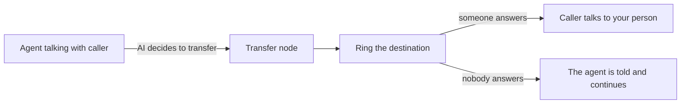

Some calls need a person: a caller who asks for one, a complaint the agent shouldn't handle, a sale that's ready to close. A transfer hands the live call from the AI to one of your people without the caller hanging up and dialling again — and hands over what the AI already learned, so the caller doesn't repeat themselves. If nobody picks up, the agent is told and carries on the conversation instead of the call ringing out.

## How a transfer works

A transfer has two halves that you configure in different places:

- **When** to transfer is the AI's decision. You describe it in plain language on a **Transfer** node, and the AI calls the transfer when the conversation matches.
- **Where** the call goes is never the AI's decision. It's a destination or a destination group you set up in advance — the AI can't invent a number or pick someone you didn't list.

The Transfer node attaches to an agent like any other function node. Its **When should the AI transfer?** field is the description the model reads, and it matters as much as the prompt: *"Use when the caller asks for a person, or wants to change an existing contract"* transfers the right calls; *"when needed"* transfers too many.

## Warm and cold transfers

| Mode | What happens | Good for |
|---|---|---|
| **Cold** | The call is connected to your person as soon as they answer; the AI leaves | Callers who asked for "a person", simple routing |
| **Warm** | When your person answers, the AI briefs them first while the caller waits on hold. Then the caller is connected and the AI leaves | Anything where the person needs context before they speak — complaints, qualified sales leads, escalations |

In a warm transfer the AI tells your colleague who is calling and why, in a couple of sentences, then connects the caller. The briefing is capped at one minute.

## What the caller hears

What the caller hears during a transfer is the same on every node, so you don't have to design it:

1. **Before dialling** — a short line in the flow's language, such as *"Connecting you now, please hold."*
2. **While it rings** — the AI keeps talking with the caller, so a wait never sounds like a dropped line. If nobody answers, the agent is told and continues the conversation.
3. **During a warm briefing** — the caller hears a hold tone while the AI briefs your colleague.

## The handoff case

Every transfer carries a short case file to the person who picks up, so they start with context instead of "how can I help you?":

| Field | Always there | What it holds |
|---|:-:|---|
| **Reason** | ✓ | Why the caller is being transferred |
| **Summary** | ✓ | What was discussed so far |
| **Caller name** | optional | Filled in when the caller gave it |
| Your own fields | — | Up to 8 extra fields you define, e.g. *Order number* or *Contract ID* |

The AI fills the case when it calls the transfer. Mark a field **required** and the AI asks the caller for it before transferring — useful when your team can't do anything without, say, an account number. People taking the call in the dashboard or the app see the case on the incoming-call screen.

## Where a transfer can go

On the Transfer node, **Who should get the call?** has two tabs:

| Tab | What rings |
|---|---|
| **Phone number** | One phone-number destination |
| **Your app** | Your own server, over a signed webhook — see [Receive transfers in your app](/build/receive-transfers-in-your-app) |
| **Your team** | **Everyone online** — everyone in the account who is available for calls right now, with nothing to set up; one [team](#teams-routing-to-the-right-people); several teams the [AI picks between](#let-the-ai-pick-the-team); a *People in the dashboard* destination; or a destination group |

Destinations and destination groups are set up once for the whole account, in **Settings → People & numbers**, and picked by name on the node. Every member can see them; owners and admins add, change and delete them.

### Destinations

A destination is one place a call can go:

<ParamField path="Phone number" type="destination">
  An outside phone number — a desk phone, a mobile, a call-center line. You choose the caller ID shown to the person answering: **The number the caller dialled** (recommended) or **The caller's own number** (some carriers reject this).
</ParamField>
<ParamField path="People in the dashboard" type="destination">
  Your teammates who are available for calls in the Talkif dashboard or the Talkif iPhone app. Choose **Everyone who is available** or **Only the people I choose**; in a team account you can also limit it to members of certain teams. The first person to accept takes the call — see [Take calls in the dashboard and the app](/calls/take-calls-in-the-dashboard-and-the-app).
</ParamField>

Emergency and special-service numbers, and premium-rate or shared-cost numbers, can't be phone destinations.

A destination can be disabled without deleting it; disabled destinations are skipped when a group rings.

### Destination groups

A destination group is a named set of destinations that ring together as one transfer target — *"Support desk"* made of two phone numbers and the people in the dashboard, for instance. Everyone in the group rings at once and the first to answer gets the call. For each member you set how long it rings, and for the group a **Give up after** time after which the transfer counts as unanswered.

Groups are the usual target: they let you change who picks up — add a number, swap a person — without editing and republishing any flow.

<Note>
  A destination or group used by a published flow can't be deleted until no published flow points at it — otherwise a live transfer would lead nowhere.
</Note>

### Call from

A transfer to a phone number is a new outgoing call, placed from one of your numbers. **Call from** on the node (or on the phone destination) picks which one; by default it's the number the caller dialled. The number's provider carries that leg. Calls that didn't arrive on one of your numbers — browser test calls, for example — need a **Call from** number to transfer to a phone.

### Managing destinations by API

Destinations and destination groups are account resources with their own endpoints, under `/api/v1/transfers/destinations` and `/api/v1/transfers/destination-groups`, so you can keep them in sync with your own staff directory.

{/* TODO: link API reference after the spec sync */}

## Teams: routing to the right people

In a team (organization) account, each member can carry **tags** — `sales`, `billing`, `turkish` — and optional **available hours**. Both are set per member, in the dashboard's organization settings or [by API](#managing-tags-and-hours-by-api). Tags are set by owners and admins; hours by the member themselves or an owner or admin.

Tags and hours belong to the organization, not to one account: a member has the same tags and hours in every account the organization owns. A personal account has no members to tag, so a transfer limited to tags rings nobody there.

- **Tags** are short labels, normalized as you save them: lowercased, spaces turned into `-`. Allowed are `a`–`z`, the Turkish letters `ı ğ ü ş ö ç`, digits, `-` and `_`, up to 32 characters. A member can carry up to 20.
- **Available hours** are a weekly schedule in the member's time zone — for each weekday, up to six time ranges such as 09:00–18:00. A range never crosses midnight; an overnight shift is two ranges on two days (22:00–24:00, then 00:00–06:00 the next day). Hours follow the local clock, so 09:00–18:00 stays 09:00–18:00 across daylight-saving changes. A member with no hours set is always within hours.

A transfer to people in the dashboard can be limited to certain tags. When it rings, it rings only members who are:

1. available for calls right now,
2. carrying one of the tags, and
3. within their available hours, if they set any.

If nobody matches, nobody is rung and the transfer fails as if nobody answered. It never falls back to ringing everyone.

### Let the AI pick the team

Pick one team under **Your team** and the node rings that team. Add a second team and the AI picks one of them from the conversation — up to 8 teams. Once there is more than one, each team needs a short description the AI reads to decide, such as *"Internet, modem or line problems."*

Talkif rings the chosen team's available members within their hours. If nobody in it answers, the agent is told and continues the conversation.

### Managing tags and hours by API

Member tags and available hours have their own endpoints, next to the destinations, so you can keep teams and shifts in sync with your staff directory or rota:

| Endpoint | What it does |
|---|---|
| `GET /api/v1/transfers/members` | Every member with their user ID, name, role, tags and hours. The user ID is what a *People in the dashboard* destination lists in `userIds` |
| `GET /api/v1/transfers/member-tags` | The tags in use, with how many members carry each |
| `GET` / `PUT /api/v1/transfers/members/{memberId}/tags` | Read or replace a member's tags |
| `GET` / `PUT` / `DELETE /api/v1/transfers/members/{memberId}/hours` | Read, set or remove a member's available hours |

They use the `transfers` API key scope — read for `GET`, write for the rest — and follow the same rules as the dashboard: every member can read, owners and admins set tags, and hours are set by the member or an owner or admin. On a personal account the lists are empty.

{/* TODO: link API reference after the spec sync */}

## When nobody answers

There's nothing to connect. When a transfer doesn't go through — busy, declined, unanswered, or nobody available — the agent that started it is told that nobody answered and continues the conversation. A good prompt for that agent says what to offer then: a callback, or taking a message.

A call can be offered to people at most **twice**. After that, a further transfer to people fails straight away and the agent carries on, so a caller isn't put through the same ringing again.

## Set up a transfer

<Steps>
  <Step title="Add destinations, if you need them">
    Ringing everyone online or a team needs no setup. To transfer to an outside number or a fixed set of people, add them under **Settings → People & numbers** — phone numbers as destinations, and a destination group for each set that should ring together.
  </Step>
  <Step title="Add a Transfer node">
    In the flow, add a **Transfer** node and attach it to the agents that may transfer. Choose **Warm transfer** or **Cold transfer**, write **When should the AI transfer?**, and under **Who should get the call?** pick a phone number or, under **Your team**, who rings.
  </Step>
  <Step title="Choose what the AI collects">
    Under **What should the AI collect first?**, add the details your colleague needs, such as an order number. Mark a detail required and the AI asks the caller for it before transferring.
  </Step>
  <Step title="Tell the agent what to do if nobody answers">
    In the prompt of each agent that can transfer, say what to offer when a transfer doesn't go through — a callback or taking a message.
  </Step>
  <Step title="Test, then publish">
    Try it in the Flow Tester with a real destination before publishing — see [Test and publish](/build/test-and-publish).
  </Step>
</Steps>

## Next

<CardGroup cols={2}>
  <Card title="Take calls in the dashboard and the app" href="/calls/take-calls-in-the-dashboard-and-the-app" icon="fa-regular fa-headset">
    Be available for transfers, accept them, and listen in on live calls.
  </Card>
  <Card title="Transfer and end calls" href="/build/transfer-and-end-calls" icon="fa-regular fa-phone-slash">
    Ending calls well, silence handling, maximum length and voicemail.
  </Card>
</CardGroup>
