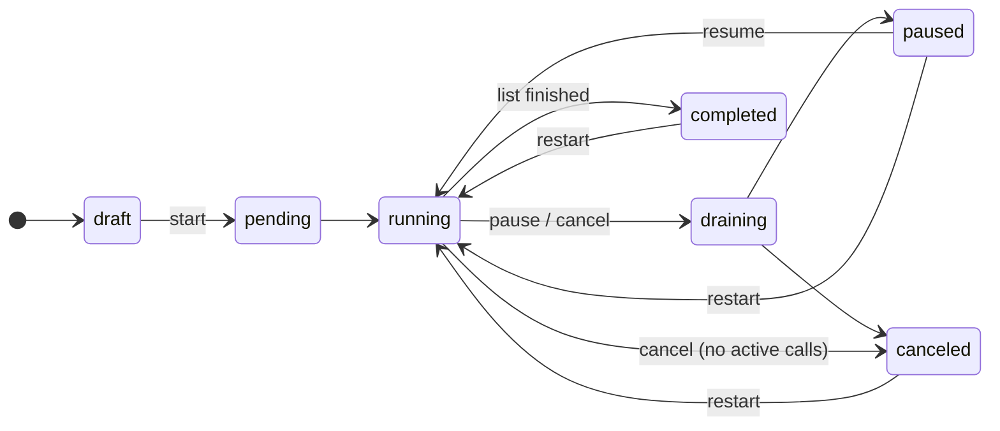

A campaign is a list of contacts, a flow, a from-number, and rules about *how fast* and *when*. You start it and Talkif works through the list: placing calls up to your concurrency, only inside the hours you allow, retrying the ones that didn't connect, skipping anyone on the Do Not Call list, and stopping when the list is done or you tell it to. The result is per-contact outcomes and an analytics view of the whole run.

## What a campaign is made of

| Setting | What it decides | Default |
|---|---|---|
| **Flow** | The published flow every call runs (latest version at the time each call is placed) | — |
| **From number** | Caller ID and routing provider — must be able to place calls | — |
| **Contacts** | Who gets called. Add individually, by filter (tags, company, search), or all | — |
| **Concurrent calls** | How many calls run at once, 1–50. Also bounded by your account's concurrent-call limit | 5 |
| **Call windows** | When calls may be placed: start–end times, optionally per weekday. None = any time | none |
| **Respect contact timezone** | Evaluate windows in each contact's local time, not yours | on |
| **Start at / End at** | Start automatically at a time; auto-pause at a time | manual start; no end |

### Contact timezones and call windows

Windows are wall-clock times. With **Respect contact timezone** on (the default), a 09:00–17:00 window means 9 to 5 *where the contact is* — a list spanning New York and Berlin is called at sensible local hours automatically. A contact's timezone comes from their record, or is derived from their phone number when not set.

Separately from your windows, Talkif enforces **legal calling hours** by jurisdiction (for US numbers, 8 am – 9 pm local, per TCPA): a contact outside those hours isn't refused, they're held until the hours open. Your windows can be tighter than the law; never looser.

### Retries

A contact whose call ends `no_answer`, `busy`, `failed` or `canceled` is retried automatically, up to **3 attempts** per contact, with a delay between attempts so the same person isn't redialled back-to-back. A contact whose call was *answered* is done — a completed conversation is never redialled, whatever was said in it. A call that reaches voicemail counts as an attempt; see [Transfer and end calls](/build/transfer-and-end-calls#safety-net-3-voicemail-outbound-only) for leaving a message versus hanging up.

### Skipping

A contact is **skipped** — never called — when their number is on the [Do Not Call list](/calls/do-not-call), when they opted out, or when you skip them manually ([`POST …/contacts/{contactId}/skip`](/api-reference/campaigns/skip-campaign-contact)). Skipped contacts don't hold a campaign open.

## Lifecycle

<ParamField path="draft" type="editable">Being configured. Add contacts, change settings.</ParamField>
<ParamField path="pending" type="transient">You pressed start; contacts are being queued.</ParamField>
<ParamField path="running" type="active">Placing calls within concurrency and windows.</ParamField>
<ParamField path="draining" type="transient">Pause or cancel requested; no new calls start, active calls finish.</ParamField>
<ParamField path="paused" type="stopped">Fully stopped. Add contacts, change settings, resume.</ParamField>
<ParamField path="completed" type="terminal">Every contact reached a final state.</ParamField>
<ParamField path="canceled" type="terminal">Stopped for good — unless restarted.</ParamField>

**Pause** always drains: calls in progress finish, nothing new starts. **Cancel** drains too if calls are active. **Restart** from paused, completed or canceled resets every contact that didn't complete back to pending and runs again — useful for a second pass at the no-answers.

### Auto-pause

A running campaign pauses itself, with a notification, when it can't safely continue:

| Reason | What happened |
|---|---|
| Insufficient balance | Your balance fell below the minimum to admit calls |
| System limit | The account's concurrency or rate limit was hit for a sustained period |
| Provider error | The from-number's provider is failing calls |
| End time | `endAt` was reached |

Fix the cause and resume; contacts pick up where they were.

## Per-contact status

Each contact's status is derived from their latest call, so it's always consistent with call history:

<ParamField path="pending" type="not yet called">Waiting for a slot and a window.</ParamField>
<ParamField path="queued" type="in progress">In the call queue or being placed.</ParamField>
<ParamField path="calling" type="in progress">On a call now.</ParamField>
<ParamField path="completed" type="final">Answered and finished.</ParamField>
<ParamField path="no_answer" type="retry or final">Didn't answer or was busy; retried until attempts run out.</ParamField>
<ParamField path="failed" type="retry or final">The call errored; retried until attempts run out.</ParamField>
<ParamField path="skipped" type="final">Never called — DNC, opt-out or manual skip.</ParamField>

When a campaign ends with contacts never dialled (cancelled early, end time reached), they're counted as **not called** in the overview.

## Setting one up

<Tabs>
  <Tab title="Dashboard">
    <Steps>
      <Step title="Call Center → Campaigns → New Campaign">
        Name it; pick the flow and the from-number.
      </Step>
      <Step title="Add contacts">
        Individually, or by filter — a tag, a company, a search — to add hundreds at once. Contacts on the DNC list are added but will be skipped.
      </Step>
      <Step title="Set pacing and windows">
        Concurrency to match what your flow and your team can absorb (a flow that creates tickets at 50 concurrent calls creates tickets fast). Windows in the contacts' local time.
      </Step>
      <Step title="Start, or schedule the start">
        Start now, or set **Start at**. Watch the first few calls' transcripts before letting it run — a prompt problem shows up in call three, not call three hundred.
      </Step>
    </Steps>
  </Tab>
  <Tab title="API">
    <EndpointRequestSnippet endpoint="POST /api/v1/campaigns" />
    <EndpointRequestSnippet endpoint="POST /api/v1/campaigns/{campaignId}/contacts/bulk" />
    <EndpointRequestSnippet endpoint="POST /api/v1/campaigns/{campaignId}/start" />

    Then [pause](/api-reference/campaigns/pause-campaign), [resume](/api-reference/campaigns/resume-campaign), [cancel](/api-reference/campaigns/cancel-campaign), [restart](/api-reference/campaigns/restart-campaign), and read progress with [`GET /campaigns/{campaignId}`](/api-reference/campaigns/get-campaign) or by subscribing to [real-time events](/integrate/real-time-events).
  </Tab>
</Tabs>

## Reading the analytics

[`GET /campaigns/{campaignId}/analytics`](/api-reference/analytics/get-campaign-analytics) (and the campaign's **Analytics** tab) gives the run a shape:

- **Outcomes** — completed / no answer / failed / skipped, as counts and percentages.
- **Attempt distribution** — how many contacts needed 1, 2 or 3 attempts. A heavy tail means your windows are wrong for the list.
- **Voicemail** — voicemail / human / undetermined for calls with a detection verdict. A high voicemail rate on a B2C list usually means daytime windows.
- **Failure causes** — grouped by structured cause, most common first, so one bad from-number or one provider outage is obvious.
- **Duration histogram** — an average hides the bimodal "hung up in 5 seconds" vs "had the conversation" split; the buckets don't.
- **Cost breakdown** and **performance** (latency, turns, function calls) across the run.

## Next

<CardGroup cols={2}>
  <Card title="Import contacts" href="/calls/import-contacts" icon="fa-regular fa-file-import">
    Get the list in from CSV, JSON or vCard.
  </Card>
  <Card title="Do Not Call" href="/calls/do-not-call" icon="fa-regular fa-ban">
    Who a campaign will never dial.
  </Card>
</CardGroup>
