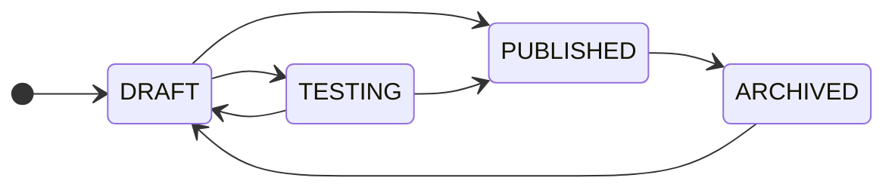

A flow is the unit you design, test, publish and roll back. Everything a caller experiences — what the agent says, which model thinks, which voice speaks, when the call moves to a different agent, when it ends — is a property of one flow. This page is about the *container*: its parts, its states, and its versions. Designing what's inside is covered in [Build agents](/build).

## What a flow is made of

| Part | What it holds | Where it's set |
|---|---|---|
| **Agents** | One **Main Agent** (entry point, owns the System Prompt) plus any number of sub-agents, each with its own Agent Prompt, functions and transitions | canvas nodes |
| **Providers** | The STT, LLM and TTS services and models the agents use | provider nodes connected to agents |
| **Functions** | What the LLM may call: built-ins like `end_call`, or your own HTTP endpoints | per agent |
| **Call settings** | Recording override, post-call insights override and instructions, voicemail behaviour, silence handling, maximum duration | flow settings panel |

Two of these need a note.

**Recording and insights resolve flow → number → account.** Each has an account-wide default. A flow can force it on or off; if the flow says *use account default*, a phone number's own override applies; if that too is *use account default*, the account setting decides. So a flow that must always record does, whatever line it's on — and a line that must never record can only guarantee it for flows that don't force recording on.

**Voicemail and silence handling are outbound-shaped.** Voicemail detection applies to outbound calls on Talkif-managed numbers; the idle handler (re-prompt a silent caller, then hang up) applies everywhere. Both are in [Transfer and end calls](/build/transfer-and-end-calls).

## The four states

<ParamField path="DRAFT" type="editable">
  Being built. Saved continuously; never used for a real call. The browser [Flow Tester](/build/test-and-publish) can run a draft — that's the only way calls touch it.
</ParamField>
<ParamField path="TESTING" type="editable">
  A draft that also answers calls on test numbers. Use it to try a flow on a real phone line before it's published anywhere. Still editable; still can't be connected to a production number.
</ParamField>
<ParamField path="PUBLISHED" type="live">
  Has at least one immutable version. Only published flows can be connected to phone numbers or named in `POST /calls`. The *draft* of a published flow stays editable — you keep working on it and publish again when ready.
</ParamField>
<ParamField path="ARCHIVED" type="retired">
  Retired. Can't be connected to numbers or named in new calls. Archiving does **not** disconnect numbers already pointing at it — reassign or disconnect them first, then archive. Versions are kept, and the flow can be reactivated to `DRAFT`.
</ParamField>

The allowed moves are exactly the arrows above. Notably, a published flow can only go to `ARCHIVED` — you don't "unpublish"; you publish a better version or archive.

## What publishing creates

Publishing does three things atomically:

1. **Validates** the draft — the checks in [Test and publish](/build/test-and-publish). Failure means nothing changes.
2. **Snapshots** the definition as a new **version**, numbered semver-style. By default the patch number increments (`1.0.3` → `1.0.4`); you can pass an explicit version instead. Each snapshot stores who published it, when, optional notes, and a diff summary against the previous version.
3. **Bumps** any phone number that was *pinned* to the previous version so it now runs the new one (see below). Numbers on *latest* need no change.

<Info title="Draft and published are separate copies">
  A flow carries two definitions: the draft you edit and the last published snapshot. Saving the draft never affects live calls. Only **Publish** moves the draft into a new version. This is why you can edit a published flow freely — and why "I changed it but callers don't hear it" always means "not published yet".
</Info>

## Which version does a call run?

Every call resolves to exactly one version at the moment it starts:

<AccordionGroup>
  <Accordion title="Inbound call on a phone number" defaultOpen>
    The number's connection decides. By default it follows **latest** — the newest published version at the moment the call arrives. Publishing a new version changes what the next inbound call hears, immediately.

    A number can instead be **pinned** to a specific version (`connectFlow` with `flowVersion`). A pinned number keeps running that version even as you publish newer ones — until you publish *over* that exact version, in which case the pin is moved to the new version in the same transaction. Pin when a customer-facing line must not change without a deliberate step.
  </Accordion>
  <Accordion title="Outbound call from the API or dashboard">
    `POST /calls` takes `flowId` and, optionally, `flowVersion`. Omit it to run the latest published version; set it to reproduce a known version — useful for A/B comparisons and for support ("the call ran 1.0.7").
  </Accordion>
  <Accordion title="Campaigns and schedules">
    Resolve to the latest published version at the moment each call is placed, not when the campaign was created. A campaign that runs for a week picks up a Tuesday publish from Tuesday onward.
  </Accordion>
  <Accordion title="Browser test calls">
    Run the **draft** as it is in the editor, including unsaved changes, so you can iterate without publishing.
  </Accordion>
</AccordionGroup>

The version a call actually ran is recorded with the call, so a transcript can always be matched to the exact prompts that produced it.

## Rolling back

A rollback re-publishes a previous version's definition as a **new** version — it doesn't delete anything or move a pointer backwards. If `1.0.9` misbehaves and you roll back to `1.0.8`, you get `1.0.10` with `1.0.8`'s content, and every number on *latest* is on it immediately. Version history stays linear and complete.

Do it from the flow's version history in the dashboard, or with [`POST /flows/{flowId}/rollback/{version}`](/api-reference/flows/rollback-flow).

## Working with versions from the API

- [`GET /flows/{flowId}/versions/{version}`](/api-reference/flows/get-flow-version) — the exact definition of any version.
- [`POST /flows/{flowId}/publish`](/api-reference/flows/publish-flow) — publish; accepts an explicit version and an `expectedVersion` for optimistic locking, so two people publishing at once can't silently overwrite each other.
- [`POST /flows/{flowId}/validate`](/api-reference/flows/validate-flow) — run the publish checks without publishing.
- [`GET /flows/{flowId}/stats`](/api-reference/analytics/get-flow-stats) — calls, outcomes and cost per flow.

## Next

<CardGroup cols={2}>
  <Card title="Test and publish" href="/build/test-and-publish" icon="fa-regular fa-circle-check">
    The validation rules, the Flow Tester, and test numbers.
  </Card>
  <Card title="Inbound and outbound routing" href="/telephony/inbound-and-outbound-routing" icon="fa-regular fa-route">
    Connecting flows to numbers, pinning, and what happens on disconnect.
  </Card>
</CardGroup>
