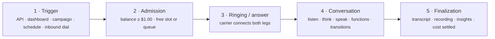

Every call, inbound or outbound, test or production, moves through the same five stages. Knowing them turns the fields you see on a call record — `status`, `agentStatus`, `endReason`, `failureCode` — from labels into a story you can act on.



## 1. Trigger

A call starts from one of four places, and the record remembers which (`source` and `direction`):

| Trigger | `direction` | `source` | Who chooses the flow |
|---|---|---|---|
| `POST /api/v1/calls` or **Start a call** in the dashboard | outbound | `direct` | the request (`flowId`, optionally `flowVersion`) |
| A [campaign](/calls/campaigns) working through its contacts | outbound | `campaign` | the campaign |
| A [schedule](/calls/schedules) firing | outbound | `scheduled` | the schedule |
| Someone dialing one of your numbers | inbound | `direct` | the flow connected to that number |

Outbound calls always go out from a number your account owns (`fromNumber`) through the provider that number belongs to. Inbound calls arrive on a number and are answered by whatever flow is connected to it at that moment — or, if nothing is connected, rejected as busy and recorded as a failed call (`failureCode: no_connected_flow`).

## 2. Admission — the two gates every call passes

Before any audio flows, Talkif checks two things. Both apply identically to outbound, inbound and browser test calls.

<AccordionGroup>
  <Accordion title="Balance: available credit must be at least $1.00" defaultOpen>
    The account must be active and have at least the platform minimum (\$1.00 by default) available. This is the only point at which Talkif can prevent a loss — once a call is running it is billed to the end even if that takes the balance negative — so the gate is strict. Below the minimum: outbound requests fail with `insufficient_balance`, inbound calls get a busy signal and a failed record with `endReason: balance_depleted`, and the queue and scheduler apply the same gate before placing anything.
  </Accordion>
  <Accordion title="Capacity: a free concurrent-call slot">
    Each account has a concurrent-call ceiling (see [Limits](/reference/limits)). When every slot is busy, an outbound call isn't refused — it's **queued**. The API answers `202 Accepted` instead of `201 Created`, with a `queueId`, your `position`, and an `estimatedWaitSeconds`. The call is placed automatically when a slot frees up, in priority order: inbound first, then direct and scheduled, then campaign, with waiting calls gaining priority over time.

    Queue entries expire if they wait too long — 60 seconds for direct calls, 10 minutes for scheduled, 24 hours for campaign — so a call you asked for at 09:00 never surprises a customer at 15:00.
  </Accordion>
</AccordionGroup>

A call that passes both gates gets an `id`, appears in **Call Center → Calls** immediately, and starts its status journey.

## 3. Status — the telephony leg

`status` tracks the phone call itself: whether the carrier has connected the two ends.

```text
queued → initiated → ringing → inprogress → completed
                                          ↘ failed | busy | noanswer | canceled
```

<ParamField path="queued" type="transient">
  Waiting for a concurrent-call slot. Outbound only.
</ParamField>
<ParamField path="initiated" type="transient">
  Talkif has asked the carrier to place the call.
</ParamField>
<ParamField path="ringing" type="transient">
  The far end is ringing.
</ParamField>
<ParamField path="inprogress" type="transient">
  Answered; audio is flowing both ways. The conversation runs in this state.
</ParamField>
<ParamField path="completed" type="terminal">
  Ended normally after being answered.
</ParamField>
<ParamField path="busy" type="terminal">
  The far end was busy. Never answered — no conversation, no per-second charges.
</ParamField>
<ParamField path="noanswer" type="terminal">
  Nobody picked up. Never answered — no conversation, no per-second charges.
</ParamField>
<ParamField path="canceled" type="terminal">
  Ended before answer, by you or by a campaign being cancelled.
</ParamField>
<ParamField path="failed" type="terminal">
  Couldn't be placed, or dropped abnormally. `failureCode` says why.
</ParamField>

A separate field, `agentStatus`, tracks the *AI* leg: `pending → connecting → active → completed`, or `errored` / `disconnected`. The two normally move together. When they don't — `status: inprogress` but `agentStatus: connecting` for more than a few seconds — the phone line is up but the agent isn't speaking yet, which usually points at a provider that's slow to warm up. The timestamps `agentConnectedAt` and `agentDisconnectedAt` on the record make this visible.

## 4. The conversation

Once both legs are `active`, the flow runs. Each *turn* is the same loop:

1. **STT** transcribes the caller as they speak, so the agent can start reasoning before they finish.
2. **LLM** reads the System Prompt, the current agent's Agent Prompt, the transcript so far, and the functions available on this agent — and returns either a spoken reply, a **function call**, or a **transition** to another agent.
3. **TTS** speaks the reply. If the caller interrupts, playback stops and the loop restarts from step 1.

Three things can happen inside the loop that you'll see in the transcript:

- **Function calls** — the agent asks your backend for data or to take an action. The result is fed back to the LLM before it replies. See [Call your backend](/build/call-your-backend).
- **Transitions** — the conversation moves to another agent in the flow. The System Prompt stays; the Agent Prompt changes. See [Design a conversation](/build/design-a-conversation).
- **Ending** — the agent decides the conversation is over and calls the built-in `end_call`; the call hangs up after the last sentence finishes playing. A hard cap (30 s – 4 h, optional per flow) and silence handling can also end a call — see [Transfer and end calls](/build/transfer-and-end-calls).

Throughout, the transcript, the recording and the running cost are updated live; the dashboard shows them as they happen.

## 5. Finalization — what a finished call gives you

When either side hangs up, the record reaches a terminal `status` and is finalized:

- **End reason** — `endReason` on the call record says *why* it ended: `caller_hangup`, `agent_completed`, `no_answer`, `busy`, `canceled`, `agent_timeout`, `agent_error`, `telephony_error`, or `balance_depleted` for an inbound call refused at the balance gate. Set once; the first cause wins.
- **Transcript** — every turn with speaker and timing. On the call page, or [`GET /calls/{callId}/transcript`](/api-reference/calls/get-call-transcript).
- **Recording** — whether calls are recorded is an account setting, overridable per number. [`GET /calls/{callId}/recording`](/api-reference/calls/get-call-recording) returns a short-lived signed link.
- **Cost breakdown** — one line item per resource (telephony seconds, STT seconds, LLM tokens in and out, TTS characters), each priced and totalled in USD. [`GET /billing/costs/calls/{callId}`](/api-reference/billing/get-billing-call-cost-breakdown).
- **Insights** — summary, sentiment, intents, topics, action items and outcome, generated from the transcript. Automatic when auto-analysis is on for the account; otherwise on demand with [`POST /calls/{callId}/analyze`](/api-reference/calls/analyze-call).

<Info title="How billing settles">
  Per-second usage is metered while the call runs and settled at finalization as one charge against your balance, consuming expiring buckets first. A running call is **never cut off for money**: if the charge takes your balance to zero or below, the call finishes normally, the shortfall is carried as a negative balance, and the account is *suspended* — new calls are refused at admission while the dashboard and billing stay open — until a top-up clears it. Accounts with auto-recharge enabled are topped up instead of suspended. [Credits and payment](/account/credits-and-payment) covers the buckets and auto-recharge.
</Info>

## Reading a call record

Put together, here is how to read the three failure-shaped fields when something goes wrong:

<AccordionGroup>
  <Accordion title="status: failed — look at failureCode">
    `failureCode` is the technical category. The ones you can act on directly:

    | Code | What to do |
    |---|---|
    | `insufficient_balance` | Top up; check auto-recharge |
    | `capacity_limit` | Queue was full — lower campaign pacing or ask for a higher ceiling |
    | `rate_limit` | Too many call requests per minute — pace your requests |
    | `flow_not_published` | The flow has no published version, or the requested `flowVersion` doesn't exist |
    | `phone_not_active` | The from-number is suspended (usually unpaid rental) or released |
    | `no_connected_flow` | Inbound call on a number with no flow |
    | `invalid_number` | Destination isn't valid E.164, or is an emergency number (blocked) |
    | `provider_error`, `network_error`, `routing_error` | Carrier-side; retry, and if it persists on one number check its configuration |
  </Accordion>
  <Accordion title="status: completed but the conversation went wrong — look at endReason and the transcript">
    A `completed` call can still be a bad one. `endReason: agent_timeout` means the agent went silent past the flow's silence limit; `agent_error` means a provider failed mid-call. The transcript shows the last turn before it happened, and the cost breakdown shows which provider was in use.
  </Accordion>
  <Accordion title="status: noanswer or busy on an outbound campaign">
    Nobody picked up. No conversation ran, so there's no transcript and no per-second cost. Campaigns retry these according to their retry policy; see [Campaigns](/calls/campaigns).
  </Accordion>
</AccordionGroup>

## Next

<CardGroup cols={2}>
  <Card title="Flows and versions" href="/concepts/flows-and-versions" icon="fa-regular fa-code-branch">
    Which version of a flow a call uses, and how to pin or roll back.
  </Card>
  <Card title="Real-time events" href="/integrate/real-time-events" icon="fa-regular fa-bolt">
    Follow a call's status and transcript live from your own systems.
  </Card>
  <Card title="Limits" href="/reference/limits" icon="fa-regular fa-gauge">
    Concurrency, queue depth, rate limits, and how the queue prioritizes.
  </Card>
  <Card title="Cost breakdown" href="/account/cost-breakdown" icon="fa-regular fa-receipt">
    Every line item on a call's bill, and how to bring it down.
  </Card>
</CardGroup>
